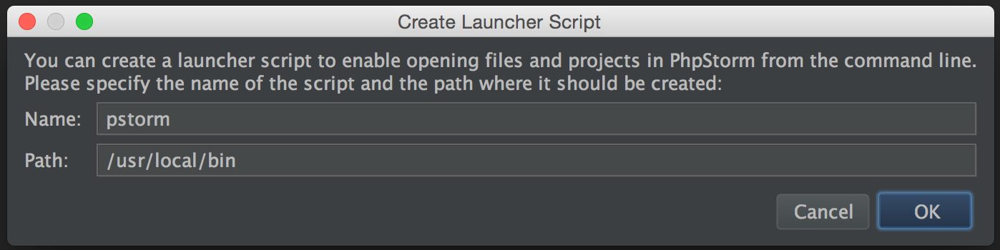
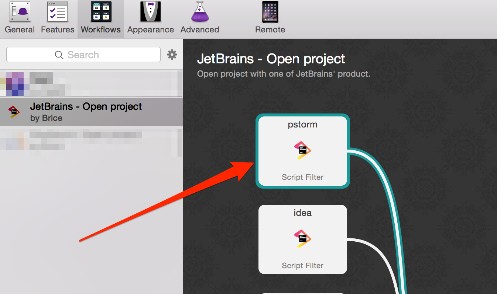
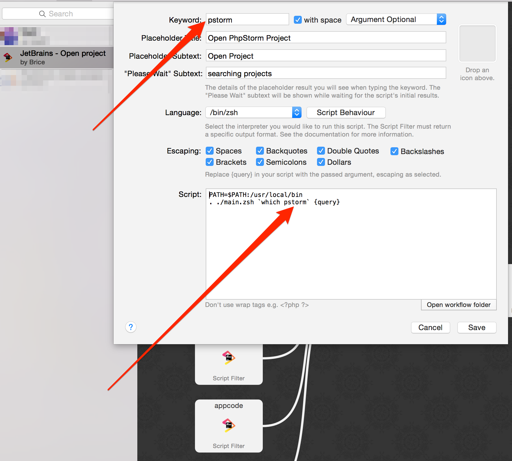
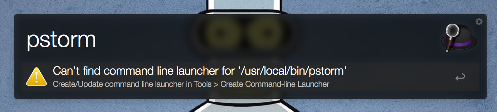

JetBrains: Open project
========================

Alfred2 workflow to easily open your projects with your favorite JetBrains product.

## Requirements
This workflow need one of JetBrains products, and its command line launchers to works:

Example with PhpStorm:

1. Open PhpStorm
2. Go to _Tools_ and _Create Command-line Launcher_

3. In the popup windows, just click on OK

## Installation
1. Download workflow from `package` folder, or [here](https://github.com/bchatard/jetbrains-alfred-workflow/blob/master/package/JetBrains%20-%20Open%20project.alfredworkflow?raw=true)
2. Double click on downloaded file (JetBrains - Open project.alfredworkflow)

## How to use
* Open Alfred with your usual hotkey
* Type keyword (example `pstorm`) followed by your project name

### Default Keywords
 * AppCode: `appcode` ;
 * CLion: `clion` ;
 * IntelliJ Idea: `idea` ;
 * PhpStorm: `pstorm` ;
 * PyCharm: `charm` ;
 * RubyMine: `mine` ;
 * WebStorm: `wstorm` ;

## Supported versions
I test with this products/versions:

* AppCode: v3.3 ;
* CLion: v1.2 / 2016.x ;
* IntelliJ Idea CE: v15 / 2016.x ;
* PhpStorm: v10 / 2016.x ;
* PyCharm CE: v5 / 2016.x ;
* RubyMine: v8 ;
* WebStorm: v11 / 2016.x ;

NB: about PhpStorm, if you need compatibility with older version please use my old workflow: [PhpStorm Alfred Workflow](https://github.com/bchatard/phpstorm-alfred-workflow)

### Customisation
If you change command line tools name/path or if you want to change keyword, you need to update workflow settings:

1. Go to Workflows and select "JetBrains - Open project"

2. Double click on a box _Run script_ for a JetBrains product (example: PhpStorm)
  * Change value in _Keyword_ field
  * Change bin value _Script_ field: `which YOUR_BIN_NAME`
  * Save

## Caskroom Users
After an application upgrade you need to update the _Command-line launcher_

## Credits
[Bash Workflow Handler](https://github.com/markokaestner/bash-workflow-handler)
